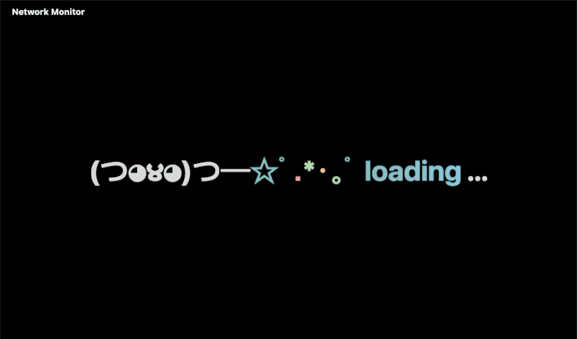
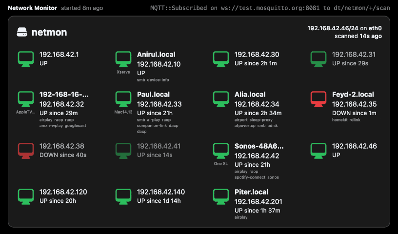

# Netmon [](https://github.com/bkahlert/netmon/blob/master/LICENSE) [![Buy Me A Unicorn](https://img.shields.io/static/v1?label=&message=Buy%20Me%20A%20Unicorn&color=c21f73&logo=data%3Aimage%2Fsvg%2Bxml%3Bbase64%2CPHN2ZyB4bWxucz0iaHR0cDovL3d3dy53My5vcmcvMjAwMC9zdmciIHZpZXdCb3g9IjAgMCA3MiA3MiI%2BPHBhdGggZmlsbD0iI0ZGRiIgZD0iTTIzLjc1NCAxMi4zNjJsMS42NjcgNy4xNjctNS4zMzMgNS4zMzMtOC4zMzQgMTQuMzMzIDEgNC42NjcgMi4xNjcgMS4zMzMgNC0uMTY3IDMuNS0zLjMzMyA2LjgzMy0xLjgzM3MxLjMzNCAxLjUgMi4xNjcgMyAzLjY2NyA0LjE2NyAzLjY2NyA0LjE2N2wuNSA2LTEuODMzIDYuMTY2LTIgMi44MzNzMjIgOS41IDMzLjE2Ni03bC0uNS02LTEuODMzLTUtMy4zMzMtNS4xNjYtMS0xLjUtLjE2Ny01LjE2Ny0yLjgzMy01LjMzMy01LTMtMi42NjctNC41LTUuMTY3LTQuMTY3LTYuNS0xLjUtNS42NjYgMS00LjE2Ny0yLjE2Ny0yLjMzNC0uMTY2eiIvPjxwYXRoIGZpbGw9IiNFQTVBNDciIGQ9Ik01MC42NzEgMjMuMTU1bDUuMjA4IDQuMDk1czUuNTY0IDguMjE4LS4zMjUgMTcuODJjLTcuMDUgMTEuNDkyIDAgMCAwIDAtMS42MTkgMy40NzUtMi4zMTUgNi43NDItMS43MzkgOS43MjJsLTUuMzEtNC40MTdWMzQuMjkybDIuMTY2LTExLjEzN3pNMjUuODk4IDE5LjI3MWwtMTUuMTEzLTcuMjUgNS4xNjYgNi4xMTkgNS4yMjQgNS44NTUgNC43MjMtNC43MjQiLz48cGF0aCBmaWxsPSIjOTJEM0Y1IiBkPSJNMjkuNzM3IDEzLjYzMWwxMC43NjcuMTM2czkuMjM4IDQuMDY2IDEwLjUzNiAxMS44MTZsLjY4NyA4Ljk1N2MtMi42MzMgNi41MzktMy4wNTYgMTQuMTI3IDIuMDg5IDIwLjgzNCAwIDAtNy4xNDUgMS4zMjEtOS44OTUtNy4xMUw0Mi4zMzggNDMuNWwuMzI1LTYuMDM0IDEuNDE3LTUuNjQzLS4yODMtNC44OTMtMi4yNzYtNC4zMTItMy41MzItMi44NDEtNS43OTItMi4wOC0yLjQ2LTQuMDY2Ii8%2BPHBhdGggZmlsbD0iIzYxQjJFNCIgZD0iTTU4LjQ1NSAzNi43NXM1LjUyIDYuNDA3IDYuOTk4IDE1LjEyYTguMDIgOC4wMiAwIDAxLS4xMzggMy4yNThjLS40MzEgMS43NTItLjgxNyA0Ljk5OC4xNDYgNy4zODMuNDY5IDEuMTYxLS41NjIgMi4zNjUtMS43ODkgMi4xMTEtMy43MS0uNzY4LTkuMjQzLTMuNjQ3LTEwLjI1Ni04LjA4N2ExLjgyNiAxLjgyNiAwIDAxLS4wNDItLjMyMWwtLjI2Ni01Ljc0NmMtLjAxMy0uMjg2LjA1Mi0uNTcuMTg3LS44MjFsMy42OTItNi44MzZjLjA2Ny0uMTIzLjExNy0uMjU1LjE0OS0uMzkybDEuMzE5LTUuNjY5Ii8%2BPGc%2BPHBhdGggZmlsbD0ibm9uZSIgc3Ryb2tlPSIjMDAwIiBzdHJva2UtbGluZWNhcD0icm91bmQiIHN0cm9rZS1saW5lam9pbj0icm91bmQiIHN0cm9rZS1taXRlcmxpbWl0PSIxMCIgc3Ryb2tlLXdpZHRoPSIyIiBkPSJNNTguNDU1IDM3Ljc4M0M2MC4yMjMgNDAuMTQ0IDY1IDQ0LjQ2NSA2NC41IDU0LjAyTTMyLjUgNDEuODg1czguNDc4IDYuNzgzIDAgMTguNzY1TTI0LjgwOSAxOS4xMzRMMTAuMjUgMTEuNzVsMTAuOTI1IDEyLjI0NSIvPjxwYXRoIGZpbGw9Im5vbmUiIHN0cm9rZT0iIzAwMCIgc3Ryb2tlLWxpbmVjYXA9InJvdW5kIiBzdHJva2UtbGluZWpvaW49InJvdW5kIiBzdHJva2UtbWl0ZXJsaW1pdD0iMTAiIHN0cm9rZS13aWR0aD0iMiIgZD0iTTM1LjE5NiAzMC44N2MuNTUgOC4zNTUtOS4zMjIgOS43MDMtMTEuOTU0IDEwLjMzNC0uMzMyLjA4LS42MzIuMjUtLjg3My40OTJsLTIuMjIzIDIuMjIzYy0uMzUuMzUtLjgyNC41NDYtMS4zMTguNTQ2aC0zLjUxMmEyLjc5NSAyLjc5NSAwIDAxLTIuNjUxLTEuOTExbC0uNTMxLTEuNTkzYTIuNzk1IDIuNzk1IDAgMDEuMjU1LTIuMzIybDguNzg2LTE0LjY0NCA0LjcyNC00LjcyNC0yLjExNi02LjkwNXM3LjgwMy0uNjk5IDguNDE0IDUuMzNjMCAwIDE2LjkyOCAyLjQ0MiAxMC41NTMgMTkuMzg0IDAgMC0xLjYyNSA1Ljk0OSAyLjM3NSAxMS4xODRNMzAuOTE3IDE0LjAyUzUzLjE2IDEwIDUwLjg3NSAzMy45OCIvPjxwYXRoIGZpbGw9Im5vbmUiIHN0cm9rZT0iIzAwMCIgc3Ryb2tlLWxpbmVjYXA9InJvdW5kIiBzdHJva2UtbGluZWpvaW49InJvdW5kIiBzdHJva2UtbWl0ZXJsaW1pdD0iMTAiIHN0cm9rZS13aWR0aD0iMiIgZD0iTTQ5LjkxOSAyMy4xNTVzMTQuNzY2IDYuNTg3IDUuNDU2IDIyLjIyYzAgMC01LjM3NSA2LjU2My42MjUgMTMuNjA0Ii8%2BPGNpcmNsZSBjeD0iMjQuNDE3IiBjeT0iMjguOTMiIHI9IjIiLz48L2c%2BPC9zdmc%2B)](https://www.buymeacoffee.com/bkahlert)

## About

**Netmon** is a network monitor that detects and displays changes in your home network.

[
Loading screen](./docs/netmon-loading.gif)

[
Recent network scan](./docs/netmon-running.gif)

The appliance consists of two parts:

- a JVM-based network scanner that publishes appearing and disappearing hosts using MQTT, and
- a Kotlin/JS and [Fritz2](https://github.com/jwstegemann/fritz2) based web interface that display the results.

Got a spare Raspberry Pi?
Both components + a Chromium browser to render the actual web interface run with no problem on a Raspberry Pi 1 or Zero.

[
Netmon on a Raspberry Pi Zero](./docs/netmon-rpi0.jpg)

Find detailed installation instructions in [rpi/INSTALL.md](rpi/INSTALL.md).

## Development

### Network scanner

#### Compile and run

```shell
./gradlew runShadow
```

#### Compile and push to Raspberry Pi

```shell
./gradlew --no-daemon clean shadowJar
rsync -rvz --delete \
  build/libs/netmon-all.jar \
  pi@netmon.local:/home/pi/netmon/netmon-scanner.jar
```

### Web Display

#### Compile and run

```shell
./gradlew jsBrowserDevelopmentRun --continuous
```

#### Compile development distribution and push to Raspberry Pi

```shell
./gradlew jsBrowserDevelopmentExecutableDistribution
rsync -rvz --delete \
  build/dist/js/developmentExecutable/ \
  pi@netmon.local:/home/pi/netmon/netmon-web-display/
```

#### Compile production distribution and push to Raspberry Pi

```shell
./gradlew --no-daemon clean jsBrowserProductionWebpack
rsync -rvz --delete \
  build/dist/js/productionExecutable/ \
  pi@netmon.local:/home/pi/netmon/netmon-web-display/
```

#### Update MQTT.js

```shell
(cd mqtt.js && ./build.sh)
```

See [mqtt.js/README.md](mqtt.js/README.md) for details.

## Contributing

Want to contribute? Awesome! The most basic way to show your support is to star the project, or to raise issues. You
can also support this project by making
a [PayPal donation](https://www.paypal.me/bkahlert) to ensure this journey continues indefinitely!

Thanks again for your support, it is much appreciated! :pray:

## License

MIT. See [LICENSE](LICENSE) for more details.
