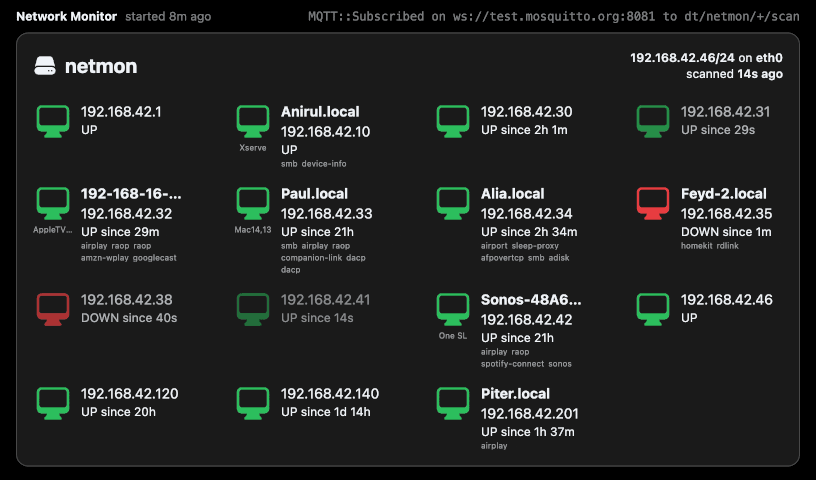
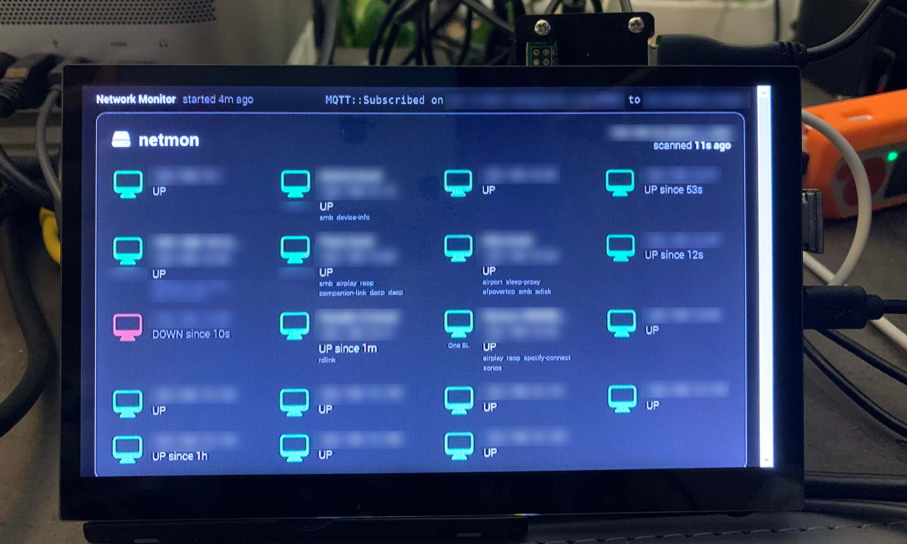

# Netmon [](https://github.com/bkahlert/netmon/blob/main/LICENSE) [](https://www.buymeacoffee.com/bkahlert)

## About

**Netmon** is a network monitor that detects and displays changes in your home network.

It uses `nmap` to detect devices and additionally used mDNS and NetBIOS to resolve hostnames.

[
Loading screen](./docs/netmon-loading.gif)

[
Recent network scan](./docs/netmon-running.gif)

The application consists of three independent parts:

- a network scanner, Kotlin compiled to a native arm64 binary with GraalVM, that publishes appearing and disappearing
  hosts using MQTT,
- a Kotlin/JS and [Fritz2](https://github.com/jwstegemann/fritz2) based web interface that display the results, by subscribing to MQTT, and
- two Debian packages, `netmon-scanner` and `netmon-display`, plus the optional `netmon-metrics`, from a signed apt
  repository at [bkahlert.github.io/netmon](https://bkahlert.github.io/netmon/), installed on a Raspberry Pi by a
  [Pi Hero](https://github.com/bkahlert/pihero) device file.

[
Netmon on a Raspberry Pi Zero with an 7-inch screen](./docs/netmon-rpi0.jpg)

## Install on a Raspberry Pi

Netmon runs on [Pi Hero 2](https://github.com/bkahlert/pihero), on a 64-bit Raspberry Pi OS: copy
[devices/sample/user-data](devices/sample/user-data) and `network-config`, set the hostname, your SSH key and Wi-Fi,
flash a card with pihero's `make flash`, and the board installs `netmon-scanner` (the scanner, Mosquitto with a
websocket listener), `netmon-display` (the web display behind lighttpd, shown full screen by `pihero-kiosk`) and
`netmon-metrics` (the board's sampler, optional). The panel's status bar shows the kiosk's CPU and memory from
`netmon-metrics`, which publishes the board's metrics every 5 s as OTLP/JSON to `dt/netmon/<node>/metrics`; without
the package the status bar shows no figures.
[devices/README.md](devices/README.md) has the details, including the one line a panel without EDID needs. The scanner
reads `/etc/netmon/scanner.conf` (`BROKER_HOST`, `BROKER_PORT`, `NMAP_*`, `NETMON_SCANNER_OPTIONS`, and `FRITZBOX_USER`
and `FRITZBOX_PASSWORD` of a FRITZ!Box account with App rights, which let the scanner read the router's host table with
names, link type and speed; `FRITZBOX_URL` overrides the box found via mDNS); the display
subscribes to the broker on the host the page was loaded from, port 8080, unless the URL's `broker.host` and
`broker.port` query parameters say otherwise. Any browser on the LAN shows the same page at `http://<host>.local/`.
Updates are `sudo apt upgrade`. Pi Hero 1's Ansible installer is frozen at the tag
[`netmon-ansible`](https://github.com/bkahlert/netmon/tree/netmon-ansible).

## Development

### Run locally

#### Run the scanner component locally

```shell
./gradlew runJvm
```

#### Run the web display component locally

Three make targets show the page while you edit it. All read it from Gradle's dev server on port 8081, take the same
variables and have a Web Inspector on the page. They differ in where the page is shown:

| Target                                       | Shows the page in                                                                          |
|----------------------------------------------|--------------------------------------------------------------------------------------------|
| `make preview-browser`                       | Any browser: the fastest, with that browser's rendering and its own developer tools        |
| `make preview-vm` (also `make preview`)      | The kiosk's own WPE WebKit, 800 by 480, in a QEMU window: exact rendering, the Mac's speed |
| `make preview-board TARGET=pi@netmon.local`  | The kiosk of a real Pi: the panel's own CPU use, the slowest                               |

| Variable  | Default   | Meaning                                                                                                                         |
|-----------|-----------|---------------------------------------------------------------------------------------------------------------------------------|
| `BROKER`  | `fake`    | `fake`: a Mosquitto container holding the `SCAN` hosts, started and stopped by the command. `board`: the Pi's own broker (`preview-board` only). `HOST:PORT`: that broker, nothing started; `localhost` is the Mac. `fixture` and `device` still work for `fake` and `board` for one release |
| `SCAN`    | `14+39`   | Recent and stable hosts of the fake; `14+39x2` publishes two scans                                                           |
| `INSPECT` | `Safari`  | What opens once the session is up: the page (`preview-browser`) or the kiosk's Web Inspector; `INSPECT=0` opens nothing         |
| `TARGET`  |           | `preview-board` only: `user@host[:port]` of the Pi, which needs Pi Hero's `pihero-kiosk` and ssh access without a prompt       |

The broker is a container, so a scan can be replaced by hand while you watch (see
[Publish a scan to the preview's broker](#publish-a-scan-to-the-previews-broker)). Only one of the three runs at a time:
Gradle allows one build per project directory, so stop them before `make test-js`, `make test-layout` or any other
`./gradlew`. `make broker` runs only the fake, for the IDE's run configuration `netmon-web-display [jsBrowserDevelopmentRun --continuous]`.

The first `make preview-vm` builds a base disk (about 2.5 minutes, cached under `~/.cache/pihero/preview`); later ones start
in about 10 seconds. It needs QEMU, Podman and Accessibility permission for your terminal (to size the window).

`make preview-board` changes nothing lasting on the Pi. One `ssh` connection carries the page, the fake broker and the
inspector between the Mac and the Pi, and the kiosk reads its session settings from a drop-in under `/run`, which Ctrl-C
removes and a reboot wipes. The page is the development bundle, so its CPU and memory use is higher than what `make deploy`
installs; compare flavors and edits with each other, not with the production figures. The status bar's CPU figure is the
Pi's own with `BROKER=board`; the fake broker publishes no metrics.

### Build and test the packages

```shell
# Gradle runs on JDK 17 (gradle/gradle-daemon-jvm.properties) and finds or downloads one itself
make build                                          # Gradle, the native binary in a podman container, then nfpm: dist/*.deb
make test                                           # tier 0 (static checks, unit tests) and tier 1 (install into a systemd container)
make test-tier2                                     # tier 2: boot a QEMU VM from devices/sample, scan, show the page in WebKit and the kiosk
make test-preview                                   # the preview's fake broker container (Podman)
make deploy TARGET=pi@netmon.local                  # the built packages onto a device, no repository involved
make soak TARGET=pi@netmon.local                    # ten minutes of memory samples of both units: dist/ssh/soak.md (the VM without TARGET)
make apt-probe TARGET=pi@netmon.local               # apt update and a reinstall next to the live stack, timed, with apt's peak
make bench TARGET=pi@netmon.local VARIANTS="main ." # the display's scripted scans on the board per variant: dist/bench/<time>/report.md
make device-model-codes                             # the model codes and SF Symbols the display draws, from this Mac
make device-icons                                   # the kind and brand icons the display draws, from the Iconify API
```

The native image is built by GraalVM's native-image inside a container
([packages/netmon-scanner/native](packages/netmon-scanner/native)), so podman is needed for make build as it is for tier
1; the binary is rebuilt only when the jar changed.

The harness is [pihero-testkit](https://github.com/bkahlert/pihero/tree/main/testkit); `uv run pytest -m installed
--target=ssh --target-uri=pi@netmon.local` checks a running device against the tests. A release is `make release
VERSION=X.Y.Z` and `git push origin vX.Y.Z`; the workflow builds, signs and publishes the repository.

The model codes the scanner recognises, and the description and SF Symbol the display draws for each, are
`src/commonMain/resources/assets/device-model-codes.json`. `make device-model-codes` regenerates it on a Mac with
[device-icons](https://github.com/bkahlert/device-icons), which reads them from macOS itself; the codes of the Fire TV
and Sonos devices the enrichers report, and the symbols of Apple types that declare none, are
[tests/device_model_codes.py](tests/device_model_codes.py)'s own.

The icons for a host's kind and for specific brands are `src/commonMain/resources/assets/device-icons.json`,
generated by `make device-icons` from [tests/device_icons.py](tests/device_icons.py) with the Iconify API: kinds from
[Material Design Icons](https://pictogrammers.com/library/mdi/) (Apache 2.0), brands from
[Custom Brand Icons](https://github.com/elax46/custom-brand-icons) (CC BY-NC-SA 4.0, non-commercial).

Tier 2 needs QEMU (`brew install qemu`) and Playwright's WebKit (`make browser`, downloaded once into Playwright's cache). It
boots the real Raspberry Pi OS root filesystem with [devices/sample/user-data](devices/sample/user-data), rendered for the VM
by `tests/vm_device.py`, lets the scanner scan QEMU's network, loads the page in WebKit at the panel's 800×480, and lets
`pihero-kiosk` show it on the VM's virtual display of that size; the run leaves `dist/tier2/display.png`, the page as WebKit
renders it, and `dist/tier2/kiosk.png`, the same page as cog paints it in the VM. `make vm` keeps the VM running for a look
around.
`make release` builds, then runs tiers 0 to 2. Tier 2 also runs weekly in CI under software emulation
([weekly.yml](.github/workflows/weekly.yml)), the signal for what rotted between releases.

### MQTT

#### Publish a host event

```shell
BROKER_HOST=test.mosquitto.org BROKER_PORT=1883
mqtt pub -t "dt/netmon/test/en0/10.10.10.0/24/host" -m '{
    "event": "host",
    "type": "up",
    "host": {
      "ip": "10.10.10.10",
      "name": "test.local",
      "status": "up",
      "since": 1692455344
    }
}' -r -h "$BROKER_HOST" -p "$BROKER_PORT"
```

#### Publish a scan to the preview's broker

The display shows scan events. The preview's broker is published as websockets on 8080 only, so the `mqtt` client above
cannot reach it; publish from inside the container. A retained scan replaces the fixture of its topic until the broker ends:

```shell
now=$(date +%s)
podman exec netmon-preview-broker mosquitto_pub -h 127.0.0.1 -r -t "dt/netmon/node/wlan0/10.0.0.1/24/scan" -m '{
    "event": "scan",
    "type": "completed",
    "timestamp": '"$now"',
    "hosts": [
      {"ip": "10.0.0.1", "name": "printer.local.", "status": "up", "since": '"$((now - 30))"'},
      {"ip": "10.0.0.2", "name": "indoorcam", "status": "down", "since": '"$((now - 5))"'}
    ]
}'
```

#### Subscribe to host events

```shell
BROKER_HOST=test.mosquitto.org BROKER_PORT=1883
mqtt sub -t dt/netmon/+/+/+/+/host -h "$BROKER_HOST" -p "$BROKER_PORT" -J
```

#### Delete a retained host event

```shell
BROKER_HOST=test.mosquitto.org BROKER_PORT=1883
mqtt pub -t "dt/netmon/test/en0/10.10.10.0/24/host" -m '' -r -h "$BROKER_HOST" -p "$BROKER_PORT"
```

### Update MQTT.js

The display gets [MQTT.js](https://github.com/mqttjs/MQTT.js) from npm. Bump the version of `npm("mqtt", …)` in
[build.gradle.kts](build.gradle.kts). It is imported as `mqtt/dist/mqtt.esm`, because the package's `browser` entry is not a
module webpack can use; see [types.kt](src/jsMain/kotlin/mqtt/types.kt).

## Contributing

Want to contribute? Awesome! The most basic way to show your support is to star the project, or to raise issues. You
can also support this project by making
a [PayPal donation](https://www.paypal.me/bkahlert) to ensure this journey continues indefinitely!

Thanks again for your support, it is much appreciated! :pray:

## License

MIT. See [LICENSE](LICENSE) for more details.
