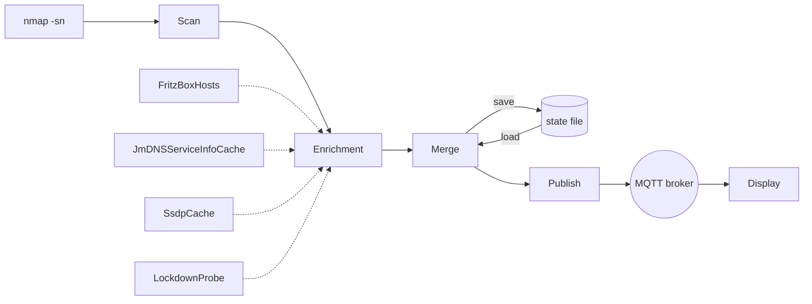

# How the scanner works

The scanner finds the hosts of each network the board is on, identifies each one from what the network tells about it,
keeps their state across scans and restarts, and publishes every scan over MQTT. The display draws the latest scan.
This page explains each step as the code does it. Known gaps live in [open issues](open-issues.md).

## Contents

1. [Overview](#overview)
2. [The scan and the state](#the-scan-and-the-state)
3. [Identification](#identification)
4. [Router and SSDP details](#router-and-ssdp-details)
5. [The display](#the-display)
6. [Configuration](#configuration)
7. [Properties to preserve](#properties-to-preserve)
8. [How to extend](#how-to-extend)

## Overview



**Scan.** [NetmonScanner](../src/jvmMain/kotlin/com/bkahlert/netmon/scanner/NetmonScanner.kt) runs nmap's ping scan
over one network and reads its XML into `Host` values: IP, status, reverse-DNS name, MAC and the vendor of the MAC
prefix.

**Enrichment.** Each scanned host passes the enricher chain:
[IdentityEnricher](../src/jvmMain/kotlin/com/bkahlert/netmon/identity/IdentityEnricher.kt) resolves name, model,
vendor, kind, link, speed and a missing MAC from clues;
[HostServicesEnricher](../src/jvmMain/kotlin/com/bkahlert/netmon/enrichment/HostServicesEnricher.kt) adds the names of
the mDNS services announced at the host's IP. Enrichers read caches that other threads fill. The one exception is the
lockdownd probe, which connects to a host while the scan loop waits.

**Merge.** [ScanResult](../src/jvmMain/kotlin/com/bkahlert/netmon/scanner/ScanResult.kt) pairs the enriched hosts with
the hosts recorded in the state file, decides UP and DOWN, keeps recorded values the scan did not yield, and saves the
result as the new state.

**Publish.** The merged scan goes to the scan topic, and every host that is new or changed its status goes to the host
topic. [MqttPublisher](../src/jvmMain/kotlin/com/bkahlert/netmon/mqtt/MqttPublisher.kt) publishes both retained, with
QoS 1.

**Display.** The page subscribes to the scan topics and redraws its cards from each scan it receives. It does not read
the host topic.

### Threads

[Application](../src/jvmMain/kotlin/com/bkahlert/netmon/Application.kt) starts one slice per interface address and
gives each slice its own caches. One network reached over Wi-Fi and a cable is scanned once, over the cable.

| Thread | One per | Reads | Writes |
|---|---|---|---|
| `manager` of [SlicedApplication](../src/jvmMain/kotlin/com/bkahlert/netmon/SlicedApplication.kt) | process | the interface addresses, every 5 s | starts and stops the workers |
| `worker:…`, the scan loop | interface address | nmap, every cache, lockdownd, the state file | the state file, MQTT |
| `fritzbox-hosts` of [FritzBoxHosts](../src/jvmMain/kotlin/com/bkahlert/netmon/router/FritzBoxHosts.kt) | interface address | the FRITZ!Box over TR-064 | the router host table |
| `ssdp-<interface>` of [SsdpCache](../src/jvmMain/kotlin/com/bkahlert/netmon/ssdp/SsdpCache.kt) | interface address | SSDP on UDP 1900, the description URLs | the SSDP cache |
| JmDNS threads, feeding [JmDNSServiceInfoCache](../src/jvmMain/kotlin/com/bkahlert/netmon/mdns/JmDNSServiceInfoCache.kt) | interface address | mDNS | the service cache, all service types |
| [LockdownProbe](../src/jvmMain/kotlin/com/bkahlert/netmon/enrichment/LockdownProbe.kt) | runs on the scan loop | TCP 62078 of a host | its own result cache |
| Paho's client threads | process | the broker | the broker |
| `read-deadline` of [BoundedInputStream](../src/jvmMain/kotlin/com/bkahlert/netmon/net/BoundedInputStream.kt) | process | nothing | closes a response stream past its deadline |

**The scan loop waits on the network only for nmap, the bounded lockdownd probe and the broker's acknowledgement of
each publish.** A worker's first start also downloads the MAC-prefix table when it is missing or older than 30 days.
Every clue source answers from memory. Network reads for clues happen on the cache threads, which may be slow or fail
without delaying a scan.

## The scan and the state

### Slices and cadence

The manager lists the interface addresses every 5 s and keeps those that are up, not loopback, site-local IPv4 or
link-local IPv6, and have between `NETWORK_MIN_HOST_BITS` and `NETWORK_MAX_HOST_BITS` host bits. Each address is a
slice, keyed by the interface's own address and prefix, for example `eth0` and `192.0.2.10/24`. The slice's worker
calls `NetmonScanner.scan()` and sleeps `SCANNER_PAUSE_DURATION`, 30 s by default, in a loop. A slice that disappears is
stopped along with its caches.

[NmapNetworkScanner](../src/jvmMain/kotlin/com/bkahlert/netmon/nmap/NmapNetworkScanner.kt) runs
`nmap -sn -T4 <cidr> -oX -`, privileged unless nmap refuses, with `-6` added for an IPv6 network and `--datadir` set to
`NMAP_DATA_DIR`. There it puts
`nmap-mac-prefixes`, fetched from nmap's repository when the cached copy is older than 30 days.
[NmapXml](../src/jvmMain/kotlin/com/bkahlert/netmon/nmap/NmapXml.kt) reads per host:

- the first IPv4 or IPv6 address, the host's identity in the list;
- the state, normally `up` in a ping scan;
- the first `hostname`, the reverse lookup;
- the MAC, lowercased, and its vendor from the prefix table.

A MAC that several hosts of one run share identifies none of them and is dropped. This happens when a Bonjour sleep
proxy answers ARP for a sleeping device.

### Host fields

[Host](../src/commonMain/kotlin/com/bkahlert/netmon/Host.kt) is what the state file stores and the topics carry. Every
field but `ip` is optional and omitted when `null`, and both sides ignore unknown keys, so scanner and display may run
different versions.

| Field | Meaning | Set by |
|---|---|---|
| `ip` | the address the host answered at | nmap |
| `name` | a human name | resolver, `name` order |
| `status` | `up` or `down` | merge |
| `since` | when the host took its current status | merge |
| `lastSeen` | the last scan that found the host up | merge |
| `model` | the hardware model as a device or protocol reports it, Apple's `@ECOLOR=…` suffix stripped; never a pseudo code for an icon | resolver |
| `vendor` | the normalized maker | resolver |
| `kind` | the class of device, from a fixed [vocabulary](#kinds) | resolver, `Generic` at worst |
| `link` | `ethernet` or `wifi`, as the router reports it | resolver, router only |
| `speed` | the router's link rate in Mbit/s; for a wired host behind a switch, the router port's | resolver, router only |
| `mac` | lowercase with colons; pairs a host across IP changes | nmap, else the router |
| `services` | the mDNS service names announced at the IP, for example `airplay` | `HostServicesEnricher` |

### UP, DOWN and since

[ScanResult](../src/jvmMain/kotlin/com/bkahlert/netmon/scanner/ScanResult.kt) `merge` decides each host's status.

| Situation | Result |
|---|---|
| Scanned up, recorded up | UP, `since` kept |
| Scanned up, recorded otherwise or not at all | UP, `since` = scan time |
| Not scanned up, recorded UP, unseen for less than `SCANNER_DOWN_AFTER` | UP, unchanged |
| Not scanned up, recorded UP, unseen for `SCANNER_DOWN_AFTER` or longer | DOWN, `since` = `lastSeen` |
| Not scanned up, recorded DOWN | unchanged |
| Not scanned up, recorded with no or an unknown status | DOWN, `since` = scan time |
| Scanned but not up, with a record | as the rows for not scanned up |
| Scanned but not up, no record | DOWN, `since` = scan time, no `lastSeen` |

"Not scanned up" covers a host nmap did not list and one it listed with a status other than `up`.

"Unseen for" counts from `lastSeen`, but never from before the slice's scanner started
([RestartFloor](../src/jvmMain/kotlin/com/bkahlert/netmon/scanner/RestartFloor.kt), on the monotonic clock). A host is
not reported DOWN because the scanner was stopped, and a wall-clock jump at boot moves the floor along. A missed scan
costs nothing: a host only goes DOWN after `SCANNER_DOWN_AFTER`, 3 minutes by default, without being seen.

The merge calls back for every host that is new or changed its status; that callback publishes the host event.
Enrichment changes publish no host event; they reach the display with the next scan.

### The state file

Each slice keeps its state in the working directory, which the unit sets to `/var/lib/netmon`:

```text
/var/lib/netmon/scan.<interface>.<address>_<prefix>.json
```

`<address>` is the interface's own address with dots and colons as dashes, so `eth0` with `192.0.2.10/24` writes
`scan.eth0.192-0-2-10_24.json`. A new DHCP address starts a new file. The file is the JSON of a `ScanResult`: the
interface, the CIDR, the timestamp and every host with all its fields. It is written after each scan to a temporary
file and moved into place atomically.

On the first scan without a state file, an unenriched nmap run with `-T5` serves as the previous scan. A file that does
not decode is logged and treated as missing.

### Merging a scan with the record

Pairing comes first:

1. A scanned host pairs with the recorded host of the same MAC.
2. A scanned host left over pairs with a recorded host of the same IP when one of the two has no MAC.
3. A recorded host left over stays in the list, unless a scanned host that is up now holds its IP.

So the state keeps every device it ever saw, DOWN, until another device takes its IP. For a host found up, the merged
fields are:

| Field | Merged value |
|---|---|
| `ip` | the scan's |
| `status`, `since`, `lastSeen` | see [UP, DOWN and since](#up-down-and-since) |
| `name`, `model`, `vendor`, `mac`, `link`, `speed`, `services` | the scan's, else the recorded one |
| `kind` | the scan's unless `Generic`, else the recorded one, else `Generic` |

The resolver gives every host a kind, `Generic` at worst. The rule above keeps a specific kind when one scan's clues
are thinner, for example before the router table has loaded. A kind therefore never falls back to `Generic`.

Consequences:

- A value persists until a scan yields a new one. A name, model or kind written by an older scanner version stays even
  when the current rules would yield nothing for that field.
- A placeholder or spoofed model an older version stored is not cleaned up by the new rules alone.
- A host's name can alternate when two sources answer in different scans, since each scan's name wins.

To start from clean state, stop the scanner, remove the state files and start it again:

```shell
sudo systemctl stop netmon-scanner
sudo rm -f /var/lib/netmon/scan.*.json
sudo systemctl start netmon-scanner
```

## Identification

### The clue model

[Clue.kt](../src/jvmMain/kotlin/com/bkahlert/netmon/identity/Clue.kt) defines three things:

- A `Clue` is one claim about one field from one `Source`, for example `Clue.Model("T8400", Source.PROTOCOL)`. Its
  kinds are `Name`, `Model`, `Vendor`, `DeviceKind`, `Attachment` (link), `Speed` and `Mac`.
- A `Source` says how far a claim is trusted: `USER`, `PROTOCOL`, `APPLE_CODE`, `MDNS_HOST`, `DNS`, `NAME_TOKEN`,
  `ROUTER`, `OUI`. Its rank differs per field.
- A `ClueSource` turns a host into clues. Every implementation reads a cache, never the network; lockdownd is the
  bounded exception.

### Clue sources

| Source class | Reads | Cache and TTL | Clues |
|---|---|---|---|
| [RouterClues](../src/jvmMain/kotlin/com/bkahlert/netmon/identity/RouterClues.kt) | `FritzBoxHosts` | table refreshed every 60 s with credentials; per-MAC answers kept 10 min without | names (`USER`, `ROUTER`), kinds (`USER`, `ROUTER`), link, speed, MAC (`ROUTER`) |
| [MdnsClues](../src/jvmMain/kotlin/com/bkahlert/netmon/identity/MdnsClues.kt) | `JmDNSServiceInfoCache` | as long as JmDNS keeps the service | names (`PROTOCOL`, `MDNS_HOST`), models, vendors, kinds (`PROTOCOL`), Apple code (`APPLE_CODE`) |
| [SsdpClues](../src/jvmMain/kotlin/com/bkahlert/netmon/identity/SsdpClues.kt) | `SsdpCache` | 30 min after the last announcement | model, vendor, kind (`PROTOCOL`) |
| [OuiClues](../src/jvmMain/kotlin/com/bkahlert/netmon/identity/OuiClues.kt) | nmap's vendor on the host | none needed | vendor, kind (`OUI`) |
| [LockdownClues](../src/jvmMain/kotlin/com/bkahlert/netmon/identity/LockdownClues.kt), fallback | `LockdownProbe` | answer 24 h, failure 5 min, per MAC, else per IP | model, vendor, kind (`APPLE_CODE`) |
| `IdentityEnricher` itself | nmap's name on the host | none needed | name (`DNS`) |
| [NameTokens](../src/jvmMain/kotlin/com/bkahlert/netmon/identity/NameTokens.kt), on every name clue | the names above | none needed | vendor, kind (`NAME_TOKEN`) |

**Router.** A host with a MAC matches the router entry of that MAC, active or not. A host without a MAC matches the
entry of its IP only while that entry is active, so a stale lease never names a new device. A host with a MAC the
router does not know gets nothing. The friendly name is a `USER` name when it differs from the hostname. The hostname
is a `ROUTER` name. `X_AVM-DE_DeviceClassUser` is a `USER` kind and `X_AVM-DE_DeviceClass` a `ROUTER` kind, each
unless `Generic`. The router's MAC fills `mac` only for a host nmap gave none. Enrichment runs before the merge, so
that MAC takes part in pairing.

**mDNS.** The records announced at the host's IP, read by their TXT keys only. Within each row the first value found
wins, in this order:

| Field | Source | Read from, in order |
|---|---|---|
| name | `PROTOCOL` | instance names of `_device-info`, `_hap`, `_airplay`; `_googlecast` `fn`; `_amzn-wplay` `n`; the `_sonos` instance after `@`; instances of `_nanoleafapi`, `_ipp`, `_companion-link` |
| name | `MDNS_HOST` | the SRV target host names |
| model | `PROTOCOL` | `_device-info` `machine`; `_hap` `md`; `_nanoleafapi` `md`; `_amzn-wplay` `n`; `_matterd` `DN`; `_ipp` `ty`, else `usb_MDL`; `_hue` `modelid`; `_meshcop` `mn` unless `BorderRouter`; then, unless an AirPlay emulator: `_googlecast` `md`, and `_airplay` `model` and `_raop` `am` when they are not Apple codes |
| model, vendor `Apple`, kind | `APPLE_CODE` | the first accepted [Apple code](#apple-model-codes) of `_device-info` `model`, `_airplay` `model`, `_raop` `am`, `_companion-link` `rpMd`; `_airplay` and `_raop` are skipped on an AirPlay emulator |
| vendor | `PROTOCOL` | `_airplay` `manufacturer` unless an emulator; `_ipp` `usb_MFG`; `_meshcop` `vn` unless `OpenThread` |
| kind | `PROTOCOL` | HAP category `ci`; `_amzn-wplay` → SetTopBox; `_matterd` `DT=35` → SetTopBox; `_ipp` or `_printer` → Printer; `_hue` → Hub; `_meshcop` `mn=BorderRouter` → Hub; `_nanoleafapi` → Lamp; `_ewelink` `type=plug` → Socket; `_googlecast` → Television; `_sonos`, `_raop` or `_airplay` → Speaker; `machine` containing `Raspberry Pi` → CircuitBoard |

**SSDP.** The description the host's own IP announced. The model is `modelNumber` unless blank or a bare version such
as `2.1`, else `modelName`. The vendor is `manufacturer`, except on an AirPlay emulator. `deviceType` gives the kind:

| `deviceType` contains | Kind |
|---|---|
| `:NAS:` | Storage |
| `:InternetGatewayDevice:` or `:fritzbox:` | Router |
| `lge:device:tv` | Television |
| `:ZonePlayer:` | Speaker |
| `:Printer:` | Printer |

**OUI.** nmap's vendor, normalized by [VendorNames](../src/jvmMain/kotlin/com/bkahlert/netmon/identity/VendorNames.kt),
and that vendor's usual kind. A private MAC (see below) gives neither. Kind defaults:

| Vendor | Kind | Vendor | Kind |
|---|---|---|---|
| Nintendo | GamingDevice | Nanoleaf | Lamp |
| Ring | DoorBell | Midea | AirConditioner |
| Tuya | Socket | Signify | Hub |
| Espressif, Raspberry Pi | CircuitBoard | HP | Printer |
| Amazon, Sonos | Speaker | LG | Television |
| AVM | Router | | |

`VendorNames.normalize` first maps a name by its start: `Raspberry Pi…` → Raspberry Pi, `Beijing Xiaomi…` → Xiaomi,
`GD Midea…` → Midea, `AVM Audiovisuelles…` and `FRITZ!…` → AVM, `Philips Lighting…` → Signify, `Smart Innovation…` →
eufy, `Hewlett Packard…` → HP, `LG Electronics…` → LG, and `Amazon`, `Tuya`, `Apple`, `Ugreen`, `Sonos`, `QEMU` to
themselves. Any other name loses trailing legal suffixes such as `Inc.`, `Ltd.`, `GmbH`, `B.V.`, `Corp.`,
`Technologies`, `Group`, `Trading`, `Foundation` and parenthesized parts.

[MacAddresses](../src/jvmMain/kotlin/com/bkahlert/netmon/identity/MacAddresses.kt) calls a MAC private when the second
hex digit is 2, 6, A or E, as in `02:aa:bb:cc:00:01`. Phones with private Wi-Fi addresses, Docker (`02:42:…`) and QEMU
(`52:54:00:…`) fall under it. Those hosts are named by the router or DNS and classified by name tokens.

**Lockdownd.** [LockdownProbe](../src/jvmMain/kotlin/com/bkahlert/netmon/enrichment/LockdownProbe.kt) asks iOS
`lockdownd` on TCP 62078 for `ProductType`, which answers without pairing. The probe runs only when no other source
produced a model and nmap's vendor is Apple or unknown. Connect takes at most 1 s and the reply 2 s, and a reply over
64 KB is refused. A code lockdownd returns is always accepted.

### The enricher flow

`IdentityEnricher.enrich` does, per host:

1. Collect the clues of the sources in the order router, mDNS, SSDP, OUI.
2. If no clue is a model, add the clues of the fallbacks (lockdownd).
3. Add nmap's name as a `DNS` name clue.
4. Read every name clue for [name tokens](#name-tokens), before placeholders are dropped. A lone `espressif` still
   says CircuitBoard, though it never becomes the name.
5. Clean every name: trim, drop a trailing `.` and `.local`, drop [placeholders](#placeholders).
6. Clear nmap's name and vendor on the host, then let
   [IdentityResolver](../src/jvmMain/kotlin/com/bkahlert/netmon/identity/IdentityResolver.kt) fill each field.

nmap's vendor still reaches the resolver, as the `OUI` clue of `OuiClues`. Both raw nmap values thus rank like every
other clue.

### Trust order per field

`IdentityResolver.resolve` fills each field with the first clue in that field's source order. Within one source the
first clue wins, so source order inside the enricher matters: mDNS models rank above SSDP models inside `PROTOCOL`.
Each field resolves on its own, so a host may take its name from the router and its model from mDNS.

| Field | Order, best first | Why |
|---|---|---|
| `name` | `USER` > `PROTOCOL` > `MDNS_HOST` > `DNS` > `ROUTER` | a name set in the router UI wins; instance names are written for people; DHCP hostnames are often defaults |
| `model` | `PROTOCOL` > `APPLE_CODE` | a hardware string beats a Finder icon code |
| `vendor` | `NAME_TOKEN` > `OUI` > `PROTOCOL` > `APPLE_CODE` | white-label devices carry the chip maker's OUI, while their names carry the brand |
| `kind` | `USER` > `APPLE_CODE` > `PROTOCOL` > `NAME_TOKEN` > `ROUTER` > `OUI` > `Generic` | an accepted Apple code outranks HAP because a HomePod advertises its sensor as HAP category 10; the router's automatic class is mostly `Generic` |
| `link`, `speed` | `ROUTER` | only the router knows |
| `mac` | `ROUTER`, only when nmap reported none | |

### Apple model codes

[AppleCodes](../src/jvmMain/kotlin/com/bkahlert/netmon/identity/AppleCodes.kt) believes a code only from a host that
could run it. Pis, NAS boxes and AirPlay receiver apps advertise Apple codes to get a Finder icon. A code is accepted
when all of these hold:

- Without its `@…` suffix, it has Apple's shape `^[A-Za-z]+\d+(?:,\d+)?$` (`iPad8,3`, `AirPort4`).
- It is a key of [model-catalog.json](../src/jvmMain/resources/assets/model-catalog.json). That scanner catalog's
  custom codes such as `One SL` lack the shape and are no Apple codes.
- The host does not announce itself as Linux: no `_workstation` service and no `_device-info` `machine`, as avahi
  publishes both.
- nmap's vendor is Apple or unknown, or the MAC is private.

A rejected code is dropped, not stored. An accepted code's optional kind comes from its explicit entry in
[model-catalog.json](../src/jvmMain/resources/assets/model-catalog.json), not its SF Symbol. Unclassified and newly
recognized codes remain without a kind until someone assigns one.

### AirPlay emulators

A host whose `_airplay` TXT carries `rmodel` runs an AirPlay receiver app, as some streaming sticks do. Its `_airplay`,
`_raop` and `_googlecast` models, its `_airplay` manufacturer and its SSDP manufacturer describe the app, so they are
ignored. Its `_amzn-wplay` record still counts.

### HAP categories

[HapCategories](../src/jvmMain/kotlin/com/bkahlert/netmon/identity/HapCategories.kt) maps `_hap` TXT `ci` by the
HomeKit category numbers. Unlisted numbers give no kind.

| `ci` | Kind | `ci` | Kind |
|---|---|---|---|
| 2 | Hub | 17 | Camera |
| 5 | Lamp | 18 | DoorBell |
| 6 | DoorLock | 19 | AirPurifier |
| 7, 8 | Socket | 21 | AirConditioner |
| 9, 20 | Thermostat | 24, 35, 36 | SetTopBox |
| 10 | Sensor | 25, 26, 34 | Speaker |
| 14 | Shutter | 31 | Television |
| 15 | Button | 16, 27, 33 | Router |

### Kinds

[Kind](../src/commonMain/kotlin/com/bkahlert/netmon/Kind.kt) is the FRITZ!Box's device class vocabulary plus
`AirPurifier`, `Hub`, `Laptop` and `Television`:

`AirConditioner`, `AirPurifier`, `Button`, `Camera`, `CircuitBoard`, `Computer`, `DoorBell`, `DoorLock`,
`GamingDevice`, `Generic`, `Hub`, `IPPhone`, `Lamp`, `Laptop`, `Monitor`, `NetworkSwitch`, `Phone`, `Printer`, `Robot`,
`Router`, `Sensor`, `SetTopBox`, `Shutter`, `SmartWatch`, `Smartphone`, `Socket`, `Speaker`, `Storage`, `Tablet`,
`Television`, `Thermostat`.

A kind is serialized as its token. An unknown token reads as `Generic`, so a newer scanner never breaks an older
display. The router's class tokens are these tokens, so `Kind.of` maps them one to one. `Generic` and unknown classes
give no clue.

### Placeholders

[Placeholders](../src/jvmMain/kotlin/com/bkahlert/netmon/identity/Placeholders.kt) drops names that identify nothing,
after a trailing `.` and `.local` are removed. Matching is case-insensitive, except `PC-` with an IPv4 address and `PC---…`, which need an upper-case `PC`.

| Pattern | Typical origin |
|---|---|
| a UUID with dashes | various |
| 32 hex digits | Home Assistant's mDNS host name |
| 12 or 16 hex digits | a bare MAC or EUI-64, as Matter devices use |
| `none` | router default |
| `PC-` followed by a dashed IPv4 address or MAC | FRITZ!Box default |
| `PC---…` | FRITZ!Box default |
| `android-` followed by hex digits | Android default |
| `espressif`, `ESP-` or `ESP_` followed by hex digits | chip maker's default |

### Name tokens

[NameTokens](../src/jvmMain/kotlin/com/bkahlert/netmon/identity/NameTokens.kt) holds one list of case-insensitive regexes,
each with a vendor, a kind or both. A pattern may match anywhere in a name unless anchored. The clues follow the order
of the name clues, then the table order.

| Pattern | Vendor | Kind |
|---|---|---|
| `^LEDVANCE` | Ledvance | Lamp |
| `^Ring` | Ring | DoorBell |
| `^Sonoff` | Sonoff | Socket |
| `^tado` | tado | Hub |
| `^FYTA` | FYTA | Hub |
| `^net[-_]ac[-_]` | Midea | AirConditioner |
| `nanoleaf` | Nanoleaf | Lamp |
| `^Sonos` | Sonos | Speaker |
| `hue` | Signify | Hub |
| `zhimi\|airpurifier` | Xiaomi | AirPurifier |
| `^espressif$\|^ESP[-_]` | | CircuitBoard |
| `iphone` | | Smartphone |
| `ipad` | | Tablet |
| `macbook` | | Laptop |
| `pi-?hole\|homeassist` | | Computer |
| `webostv\|^tv\d` | | Television |
| `cam\b\|camera` | | Camera |
| `^NPI\|laserjet\|printer` | | Printer |
| `homepod` | | Speaker |

A bare `\bTV\b` would turn a plug named `LEDVANCE-Hallway-TV` into a television; hence `webostv` and `^tv\d`.

### Why these sources

The sources were chosen by probing a real home LAN of about 50 hosts and a router that knew 101.

| Source | What it told | Cost |
|---|---|---|
| FRITZ!Box TR-064 host list, with credentials | all 101 entries: MAC, IP, active, hostname, user-set friendly name, `802.11` or `Ethernet`, link speed, LAN port, guest flag, automatic and user-set class | 1 SOAP call plus 1 GET, 125 KB, 0.25 s |
| FRITZ!Box `GetSpecificHostEntry`, without credentials | hostname, interface type, active | 43 ms per host |
| mDNS TXT records | the fields in the [mDNS table](#clue-sources) | none, JmDNS caches them anyway |
| SSDP descriptions | `manufacturer`, `modelName`, `modelNumber`, `deviceType`, `friendlyName` from 9 responders: router, NAS, light bridge, speaker, TV, streaming stick, light panels | one multicast, a few small GETs |
| OUI | vendor, often long, and wrong for white-label hardware: Tuya chips in Ledvance plugs, Espressif in a plant-sensor hub | none |

What the probe showed about trust:

- The router's automatic class was `Generic` for 97 of 101 entries and `Smartphone` for both streaming sticks, so it
  ranks low for kind. Its vocabulary is good, so `Kind` adopts it.
- `_device-info` `model` is a Finder icon code. It is genuine on Apple devices and spoofed on every Pi (`AirPort4`), the
  NAS (`MacPro7,1@ECOLOR=…`), a Linux kiosk (`Mac15,4@ECOLOR=…`) and a streaming stick (`AppleTV3,1` from an AirPlay
  receiver app whose `rmodel` says `AirReceiver3,1`). Hence the acceptance rules and the emulator rule.

Rejected after testing:

| Approach | Why not |
|---|---|
| `nmap -O -sV` | 9 s per host, and says little more than `lwIP` |
| passive DHCP sniffing | no DHCP packet in six minutes |
| reverse DNS through the router | answered for only half of the network's addresses |
| HTTP probing of well-known paths | adds nothing over SSDP |
| Tuya (UDP 6667) and Midea (UDP 6445) protocols | work, but the router already names those devices |
| the Pi-hole API | needs a session |
| an override table in netmon | the router UI is the place to name or classify a device |

## Router and SSDP details

### FRITZ!Box

[FritzBoxEndpoint](../src/jvmMain/kotlin/com/bkahlert/netmon/router/FritzBoxHosts.kt) picks the TR-064 endpoint anew
before every call, in this order:

1. `FRITZBOX_URL`, when set.
2. The first `_tr064._tcp` mDNS record: TXT `ipv4`, else its IPv4 address, with the SRV port or 49000.
3. `http://fritz.box:49000`.

[Tr064Client](../src/jvmMain/kotlin/com/bkahlert/netmon/router/Tr064Client.kt) posts SOAP to `/upnp/control/hosts`,
service `urn:dslforum-org:service:Hosts:1`. An answer of 401 is repeated once with HTTP Digest authentication
([DigestAuth](../src/jvmMain/kotlin/com/bkahlert/netmon/router/DigestAuth.kt), RFC 7616, MD5, `qop=auth`). The body goes
with both requests, because the box answers an empty body with `XML error` instead of a challenge. A fault's
`errorDescription` becomes `Tr064Exception.fault`.

**With credentials** (`FRITZBOX_USER` and `FRITZBOX_PASSWORD`, both set), the `fritzbox-hosts` thread starts with the
slice and refreshes every 60 s:

1. Call `X_AVM-DE_GetHostListPath` and GET the returned path, which carries a session id.
2. Stream the XML through [HostListParser](../src/jvmMain/kotlin/com/bkahlert/netmon/router/HostListParser.kt), one
   `Item` at a time, into [RouterHost](../src/jvmMain/kotlin/com/bkahlert/netmon/router/RouterHost.kt) values. The
   list is never held as a tree.
3. Index by MAC and by IP. Of several entries with one key, an active one wins.

A failed refresh keeps the last table. `InterfaceType` `Ethernet` maps to `ethernet` and `802.11` to `wifi`.
`X_AVM-DE_Speed` above 0 is the speed.

**Without credentials**, there is no table. `byMac` queues a MAC it has no fresh answer for and returns what it has.
The `fritzbox-hosts` thread starts with the slice in both modes. Without credentials it waits for queued MACs and calls
`GetSpecificHostEntry` for one MAC after the other. An answer,
including the box's `NoSuchEntryInArray`, is kept 10 minutes. After a transport or authentication failure, the rest of
that batch is dropped and asked again on the next lookup. This mode yields hostname, link and active; no friendly
name, class or speed. `byIp` answers nothing, so a host without a MAC gets no router clues.

`byMac` and `byIp` never touch the network. The scan reads whatever the thread has loaded, stale or not.

Failures are logged once when they begin, at WARN, with the session id masked; recovery is logged once, at INFO.

### SSDP

`SsdpCache.listen` binds a multicast socket to UDP 1900 with address reuse, joins `239.255.255.250` on the slice's
interface and reads with a 1 s timeout into an 8 KB buffer. It sends `M-SEARCH` with `ST: ssdp:all` and `MX: 2` at start
and every 10 minutes. Every search response and `NOTIFY` that
[SsdpMessage](../src/jvmMain/kotlin/com/bkahlert/netmon/ssdp/SsdpMessage.kt) parses is offered to the cache:

- `ssdp:byebye` removes the sender's entry.
- `LOCATION` counts only with scheme `http` and a host that is the sender's IP written as an address literal. Literals
  are parsed by hand, so a host name never triggers a DNS lookup.
- A location not seen within 30 minutes is fetched on the listener thread by
  `DescriptionFetcher` in [SsdpCache.kt](../src/jvmMain/kotlin/com/bkahlert/netmon/ssdp/SsdpCache.kt): HTTP/1.1, 3 s to the
  headers, 3 s for the body, at most 256 KB, status 200 only.
- [DeviceDescription](../src/jvmMain/kotlin/com/bkahlert/netmon/ssdp/DeviceDescription.kt) reads the root `device`'s
  `friendlyName`, `manufacturer`, `modelName`, `modelNumber`, `deviceType` and `UDN`, and stops at its `deviceList`.
- A failed fetch is remembered for 30 minutes, so a broken location (one device answered 422) is not fetched again.
- An entry is keyed by the sender's IP and expires 30 minutes after the last announcement of its location.
- At most 512 locations are kept. While that many are fresh, a new location is ignored.

## The display

The page connects over websockets to the host it was loaded from, port 8080, unless the URL's `broker.host` and
`broker.port` query parameters say otherwise. [events.kt](../src/jsMain/kotlin/com/bkahlert/netmon/ui/events.kt)
subscribes to `dt/netmon/+/+/+/+/scan` and the metrics topic with QoS 1. The CIDR in the scan topic holds a slash, so
it spans two levels. Each decoded scan replaces the host list of its source (node, interface, CIDR). A scan older than
`scan.outdatedThreshold`, 5 minutes by default, is ignored and removed.

### Icons

`hostIcon` in [network.kt](../src/jsMain/kotlin/com/bkahlert/netmon/ui/network.kt) picks the first that exists:

1. The SF Symbol of a model with Apple's shape that
   [device-model-codes.json](../src/jsMain/resources/assets/device-model-codes.json) knows.
2. The first `specific` matcher of
   [device-icons.json](../src/jsMain/resources/assets/device-icons.json) that fits vendor, model and name.
3. The icon of the host's kind.
4. The generic display glyph.

[DeviceIcons](../src/commonMain/kotlin/com/bkahlert/netmon/model_identification/DeviceIcons.kt) reads the asset.
`kinds` maps every kind token to a symbol id, `specific` lists regex matchers to a symbol id, and `symbols` maps symbol
ids to SVGs. A matcher's regexes are case-insensitive; every field it gives must match, and a host without that value
never matches. The shipped matchers go by vendor alone: Sonos, Signify, Ring, tado, AVM, Raspberry Pi and Nintendo.

`make device-icons` regenerates the asset with [device_icons.py](../tests/device_icons.py) from the Iconify API. Kind
icons and the Raspberry Pi and Nintendo Switch shapes come from Material Design Icons (Apache 2.0). Brand wordmarks
come from Simple Icons (CC0 1.0); the marks remain their owners' trademarks and are shown only next to that vendor's
devices. The generator wraps each icon in a square `viewBox`, adds `data-symbol-name`, and refuses any SVG with a tag or
attribute outside a small allowlist. The SF Symbols asset comes from `make device-model-codes`, run on a Mac.

### Cards

Each card shows:

- the icon, tinted by status, and the model's description from the code table, else the raw model;
- a caption: the name up to its first dot, else the model's description or the raw model, else the kind's label (`Set
  Top Box`), else the last 8 characters of the MAC, else `❔`;
- the vendor, else `<unknown vendor>`;
- the IP;
- the link badge, only when the host has a link: the `mdi:wifi` or `mdi:ethernet` glyph and the speed as
  [LinkSpeed](../src/commonMain/kotlin/com/bkahlert/netmon/LinkSpeed.kt) formats it (`72 Mbit/s`, `2.5 Gbit/s`), or
  `Wi-Fi` and `Ethernet` without a speed;
- the status and the time since `since`.

[HostGroup](../src/commonMain/kotlin/com/bkahlert/netmon/HostGroup.kt) groups the cards by kind, each group after its
label, in this order. Empty groups are left out. Within a group, IPv4 comes before IPv6, each by its bytes as unsigned
numbers, then by name, nameless last.

| Group | Kinds |
|---|---|
| Network | Router, NetworkSwitch |
| Computers | Computer, Laptop, Storage, CircuitBoard, Printer, Monitor |
| Phones & tablets | Smartphone, Phone, IPPhone, Tablet, SmartWatch |
| Media | Television, SetTopBox, Speaker, GamingDevice |
| Smart home | Hub, Lamp, Socket, Sensor, Camera, Thermostat, DoorBell, DoorLock, Button, Shutter, AirConditioner, AirPurifier, Robot |
| Other | Generic, no kind |

An UP card carries `data-age` from [OnlineAge](../src/commonMain/kotlin/com/bkahlert/netmon/OnlineAge.kt), updated once
a minute. [styles.css](../src/jsMain/resources/styles.css) steps its ring and tint down with age; nothing animates.

| `data-age` | Up for less than |
|---|---|
| `5m` | 5 minutes |
| `20m` | 20 minutes |
| `1h` | 1 hour |
| `12h` | 12 hours |
| `24h` | 24 hours |
| `older` | no limit, no tint |

## Configuration

The scanner reads settings from system properties, then from environment variables.
[EnvironmentKeys.kt](../src/jvmMain/kotlin/com/bkahlert/kommons/config/EnvironmentKeys.kt) derives the variable names,
for example `fritzbox.url` → `FRITZBOX_URL`. On the board, the unit
[netmon-scanner.service](../packages/netmon-scanner/root/usr/lib/systemd/system/netmon-scanner.service) sets a few and
reads `/etc/netmon/scanner.conf` as an optional `EnvironmentFile`. That file is created by hand and not packaged; keep
it at mode 600, since it holds the router password.

| Variable | Code default | Unit sets | Meaning |
|---|---|---|---|
| `FRITZBOX_URL` | discovery, see [FRITZ!Box](#fritzbox) | | the TR-064 base URL, for example `http://192.0.2.1:49000` |
| `FRITZBOX_USER`, `FRITZBOX_PASSWORD` | | | a FRITZ!Box account with App rights; both are needed for the full host table, and they are read verbatim |
| `BROKER_HOST` | `test.mosquitto.org`, a public broker | `127.0.0.1` | the MQTT broker |
| `BROKER_PORT` | `8080` | `1883` | 8080 and 8081 use `ws://`, any other port `tcp://` |
| `NMAP_PRIVILEGED` | `true` | | run nmap with `--privileged`; falls back once nmap refuses |
| `NMAP_DATA_DIR` | `./nmap` | `/var/lib/netmon/nmap` | nmap's data directory, holding the MAC prefix table |
| `XDG_CACHE_HOME` | `~/.cache` on Linux, `~/Library/Caches` on macOS | `/var/cache/netmon` | the base of the download cache, where the MAC prefix table is cached before it is copied to `NMAP_DATA_DIR` |
| `SCANNER_PAUSE_DURATION` | `PT30S` | | the pause between two scans of a slice |
| `SCANNER_DOWN_AFTER` | `PT3M` | | how long a host may stay unseen before it is DOWN |
| `NETWORK_MIN_HOST_BITS`, `NETWORK_MAX_HOST_BITS` | `4`, `16` | | the sizes of networks scanned |
| `SCAN_TOPIC`, `HOST_TOPIC` | `dt/netmon/${node}/${interface}/${cidr}/scan`, `…/host` | | the topics |
| `NETMON_SCANNER_OPTIONS` | | `-Xmx48m` | the native image's runtime options, read by the unit only |

Credentials never appear in logs. [FritzBoxSettings](../src/jvmMain/kotlin/com/bkahlert/netmon/router/FritzBoxSettings.kt) prints `user=<set>` and
`password=***`, [Credentials](../src/jvmMain/kotlin/com/bkahlert/netmon/router/Credentials.kt) prints no values, and warnings mask the host list's session id.

## Properties to preserve

- **The scan loop rule.** A clue source reads memory. Anything that needs the network gets its own thread and cache,
  like [FritzBoxHosts](../src/jvmMain/kotlin/com/bkahlert/netmon/router/FritzBoxHosts.kt) and
  [SsdpCache](../src/jvmMain/kotlin/com/bkahlert/netmon/ssdp/SsdpCache.kt). The only probe on the scan loop is
  lockdownd, bounded to 3 s and cached. Publishing is still synchronous; see
  [open issues](open-issues.md#scanner-and-identification).
- **Bounded reads.** Every network-fed read has a size cap and a deadline:

  | Read | Cap | Deadline |
  |---|---|---|
  | TR-064 SOAP answer | 256 KB | 10 s headers, 10 s body |
  | TR-064 host list | 1 MB | 20 s headers, 20 s body |
  | SSDP description | 256 KB | 3 s headers, 3 s body |
  | SSDP datagram | 8 KB | 1 s receive timeout |
  | lockdownd reply | 64 KB | 1 s connect, 2 s reply |

  [BoundedInputStream](../src/jvmMain/kotlin/com/bkahlert/netmon/net/BoundedInputStream.kt) enforces the HTTP ones; the
  deadline also ends a blocked read.
- **Bounded structures.** The SSDP cache keeps at most 512 locations and drops expired entries. The router lookups
  without credentials are deduplicated and drop stale answers.
- **SecureXml for all XML.** nmap's output, TR-064 answers, the host list, device descriptions and lockdownd's plist
  go through [SecureXml](../src/jvmMain/kotlin/com/bkahlert/netmon/xml/SecureXml.kt), a streaming reader without DTDs
  or external entities.
- **No DNS for SSDP.** A `LOCATION` is followed only to the sender's own IP literal.
- **Only shipped SVG reaches `innerHTML`.** The display inlines SVG from its two assets only. Host fields from the
  network are rendered as text. The generator's allowlist keeps the asset to plain shapes.
- **Credentials stay out of text.** No `toString`, log line or exception message carries the user or password.
- **Optional fields.** New `Host` fields stay optional, and [JsonFormat](../src/commonMain/kotlin/com/bkahlert/netmon/serialization/JsonFormat.kt) keeps ignoring unknown keys and omitting nulls.

## How to extend

Run `make test-jvm`, `make test-js` and `make test-tier0` after any of these changes.

### Add a name token

1. Add a `token(pattern, vendor, kind)` line to `NameTokens.tokens` in
   [NameTokens.kt](../src/jvmMain/kotlin/com/bkahlert/netmon/identity/NameTokens.kt). Anchor brand prefixes with `^`.
   An earlier line wins over a later one for the same name.
2. Use a vendor spelling that `normalize` of [VendorNames](../src/jvmMain/kotlin/com/bkahlert/netmon/identity/VendorNames.kt) would produce, so icon matchers find it.
3. Add a row to [NameTokensTest](../src/jvmTest/kotlin/com/bkahlert/netmon/identity/NameTokensTest.kt), and a negative
   case if the pattern could hit a location word, as `LEDVANCE-Hallway-TV` does for TV.
4. If the name is a default that identifies nothing, add it to [Placeholders](../src/jvmMain/kotlin/com/bkahlert/netmon/identity/Placeholders.kt) and
   [PlaceholdersTest](../src/jvmTest/kotlin/com/bkahlert/netmon/identity/PlaceholdersTest.kt) instead. Tokens still read
   it.

### Add a clue source

1. Put any network access on its own daemon thread with a cache, bounded as above. Give the cache a small lookup
   interface, like [RouterHostLookup](../src/jvmMain/kotlin/com/bkahlert/netmon/router/RouterHost.kt) or
   [SsdpLookup](../src/jvmMain/kotlin/com/bkahlert/netmon/ssdp/SsdpCache.kt), so tests can fake it.
2. Implement `ClueSource` over that interface. Pick the `Source` per clue by how far it is trusted; a new `Source` value
   needs a place in each order of [IdentityResolver](../src/jvmMain/kotlin/com/bkahlert/netmon/identity/IdentityResolver.kt) and a case in
   [IdentityResolverTest](../src/jvmTest/kotlin/com/bkahlert/netmon/identity/IdentityResolverTest.kt).
3. Add it to `sources` in [Application](../src/jvmMain/kotlin/com/bkahlert/netmon/Application.kt). Its position decides
   its rank within a shared `Source`. A source that should only run when no model is known goes to `fallbacks`.
4. Test it with a fake cache, as [RouterCluesTest](../src/jvmTest/kotlin/com/bkahlert/netmon/identity/RouterCluesTest.kt)
   and [SsdpCluesTest](../src/jvmTest/kotlin/com/bkahlert/netmon/identity/SsdpCluesTest.kt) do, and the flow in
   [IdentityEnricherTest](../src/jvmTest/kotlin/com/bkahlert/netmon/identity/IdentityEnricherTest.kt).

### Add a kind

1. Add the entry to [Kind](../src/commonMain/kotlin/com/bkahlert/netmon/Kind.kt); use the router's token if it has one.
   Update `the_vocabulary_is_the_routers_plus_four` in
   [KindTest](../src/commonTest/kotlin/com/bkahlert/netmon/KindTest.kt).
2. Put it in exactly one group of [HostGroup](../src/commonMain/kotlin/com/bkahlert/netmon/HostGroup.kt);
   [HostGroupTest](../src/commonTest/kotlin/com/bkahlert/netmon/HostGroupTest.kt) checks this.
3. Map it from the rules that should yield it: [HapCategories](../src/jvmMain/kotlin/com/bkahlert/netmon/identity/HapCategories.kt),
   [MdnsClues](../src/jvmMain/kotlin/com/bkahlert/netmon/identity/MdnsClues.kt),
   [SsdpClues](../src/jvmMain/kotlin/com/bkahlert/netmon/identity/SsdpClues.kt),
   `AppleCodes.kindOf` in [AppleCodes](../src/jvmMain/kotlin/com/bkahlert/netmon/identity/AppleCodes.kt),
   the kind defaults of [OuiClues](../src/jvmMain/kotlin/com/bkahlert/netmon/identity/OuiClues.kt), or
   [NameTokens](../src/jvmMain/kotlin/com/bkahlert/netmon/identity/NameTokens.kt), each with its test.
4. Give it an icon in `KINDS` of [device_icons.py](../tests/device_icons.py) and run `make device-icons`.
   [test_device_icons.py](../tests/test_device_icons.py) checks the generated data, and
   [PresentationAssetsTest](../src/jsTest/kotlin/com/bkahlert/netmon/model_identification/PresentationAssetsTest.kt)
   checks the browser can fetch the packaged assets.

### Add an icon

1. For a kind, change its `KINDS` entry. For a brand or model, add a matcher to `SPECIFIC` in
   [device_icons.py](../tests/device_icons.py); matchers are tried in order over the resolved vendor, model and name.
2. Take icons from Material Design Icons (`mdi:`) or Simple Icons (`simple-icons:`) only; the generator's tests reject
   other sets.
3. Run `make device-icons` and commit the regenerated
   [device-icons.json](../src/jsMain/resources/assets/device-icons.json).
4. Cover the precedence in [NetworkKtTest](../src/jsTest/kotlin/com/bkahlert/netmon/ui/NetworkKtTest.kt) and matcher
   behaviour in [DeviceIconsTest](../src/commonTest/kotlin/com/bkahlert/netmon/model_identification/DeviceIconsTest.kt).
