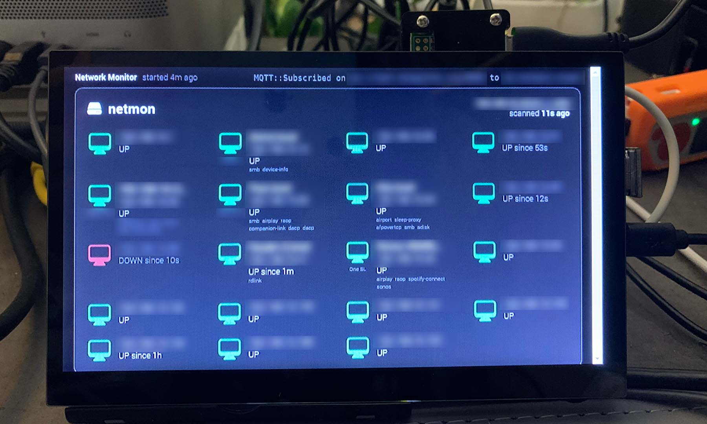

# Installation on a Raspberry Pi

This document describes how to install the Network Monitor on your Raspberry Pi.

It has been tested with a Raspberry Pi Zero with Wireless network and with an Ethernet adapter.

[
Netmon on a Raspberry Pi Zero](../docs/netmon-rpi0.jpg)

After having spent hours on getting Chromium running on a Raspberry Pi Zero with Raspberry Pi OS Lite (Bullseye),
I just used an image of [PiSignage](https://pisignage.com/). The app seems quirky,
but the [provided image for the Raspberry Pi Zero](https://drive.google.com/file/d/1w3xcL0xFHU486bzzriImTuiwg9NHjudq/view?usp=sharing) works at least.

In contrast to [Anthias](https://github.com/Screenly/Anthias/blob/master/docs/developer-documentation.md),
which didn't even have a working Docker ("Segmentation fault") installed and when fixed required some container to be started manually,
but finally always got stuck.

## Installation steps

1. Download https://drive.google.com/file/d/1w3xcL0xFHU486bzzriImTuiwg9NHjudq/view?usp=sharing to get a running system with Chromium installed.
2. Unzip image
3. Flash image to SD card
    - Be sure to install wpasupplicant to get Wi-Fi working, if needed.
    - Otherwise, you can also use an Ethernet adapter.
4. Insert SD card into Raspberry Pi
5. Boot your Raspberry Pi
6. Find out the IP address of your Raspberry Pi
    - If you're using PiSignage, it tells you its IP address on the screen.
    - Even better, its hostname is `raspberrypi.local`. The following steps assume this hostname.
7. [Copy your SSH key to the Raspberry Pi](#copy-ssh-key)
8. [Change hostname](#change-hostname)
9. [Build artifacts](#build-artifacts)
10. [Install artifacts](#install-artifacts)
    - Be patient, the installation takes a couple of minutes.
    - On your computer [check if the scanner already scans your network](#mqqt-commands).
    - Try a reboot if it doesn't, although the installation script has completed.
11. The device can now be accessed via:
    - SSH: `ssh pi@netmon.local`
    - Player UI: http://netmon.local:8000/
        - Username: pi
        - Password: pi
12. Optional steps that you might or might not find useful are in the [Cheat sheet](#cheat-sheet) section.

### Copy SSH key

```shell
NETMON_HOST=raspberrypi.local
NETMON_USER=pi
NETMON_PASSWORD=pi
sshpass -p "$NETMON_PASSWORD" \
  ssh-copy-id \
        -i ~/.ssh/id_rsa \
        -o UserKnownHostsFile=/dev/null \
        -o StrictHostKeyChecking=no \
        -o PreferredAuthentications=password \
        "$NETMON_USER"@"$NETMON_HOST"
```

### Change hostname

```shell
NETMON_HOST=raspberrypi.local
NETMON_HOST_NEW=netmon
NETMON_USER=pi
NETMON_PASSWORD=pi
curl -s "http://$NETMON_HOST:8000/api/settings/hostname" -u "$NETMON_USER":"$NETMON_PASSWORD" \
     -H 'Content-Type: application/json;charset=UTF-8' \
     --data-raw '{"localName":"'"$NETMON_HOST_NEW"'","note":"Network Monitor, https://github.com/bkahlert/netmon"}' | jq
```

The output should contain `"success": true`.

Reboot with:

```shell
NETMON_HOST=raspberrypi.local
NETMON_USER=pi
ssh \
  -o UserKnownHostsFile=/dev/null \
  -o StrictHostKeyChecking=no \
  "$NETMON_USER"@"$NETMON_HOST" 'sudo reboot'
```

Your device might need multiple reboots.
Just run the command until you can't reach the device anymore with the old name.

### Build artifacts

This step builds the artifacts and places them in `rootfs/home/pi/netmon`:

```shell
chmod +x build-artifacts.sh
./build-artifacts.sh
```

### Install artifacts

This step installs the artifacts on the device, and
the services needed to run the application:

```shell
chmod +x patch-rpi.sh
NETMON_HOST=netmon.local ./patch-rpi.sh
```

## Cheat sheet

**The most useful commands are shown when you log in to your device. They can also be found in [motd](rootfs/etc/motd).**

### MQTT commands

```shell
BROKER_HOST=test.mosquitto.org
BROKER_PORT=1883
SCANNER_NODE=foo
SCANNER_INTERFACE=en0
SCANNER_CIDR=192.168.0.0/24

# Subscribe to all scan events 
mqtt sub -t dt/netmon/+/+/+/+/scan -h "$BROKER_HOST" -p "$BROKER_PORT"

# Subscribe to scan events of a specific scanner 
mqtt sub -t dt/netmon/"$SCANNER_NODE"/+/+/+/scan -h "$BROKER_HOST" -p "$BROKER_PORT"

# Remove the retained scan event of a specific scanner
mqtt pub -t dt/netmon/"$SCANNER_NODE"/"$SCANNER_INTERFACE"/"$SCANNER_CIDR"/scan -m '' -r -h "$BROKER_HOST" -p "$BROKER_PORT"
```

### Updating artifacts

```shell
./build-artifacts.sh
NETMON_HOST=netmon.local ./patch-rpi.sh
```

### Updating web UI credentials

```shell 
NETMON_HOST=netmon.local
NETMON_USER=pi
NETMON_PASSWORD=pi
NETMON_NEW_USER=pi
NETMON_NEW_PASSWORD=raspberry
curl -s "http://$NETMON_HOST:8000/api/settings/user" -u "$NETMON_USER":"$NETMON_PASSWORD" \
     -H 'Content-Type: application/json;charset=UTF-8' \
     --data-raw '{"user":{"name":"'"$NETMON_NEW_USER"'","newpasswd":"'"$NETMON_NEW_PASSWORD"'"}}' | jq
```

### Disable Wi-Fi

If you don't have a Wi-Fi interface, or just don't want to use it, you can disable the appropriate service.
This speeds up the boot process and reduces the number of log errors.

```shell
sudo systemctl stop hostapd
sudo systemctl disable hostapd
```

### Set HDMI resolution

To set a specific HDMI resolution, https://www.raspberrypi.com/documentation/computers/config_txt.html#the-edid-filter is a useful resource.

- Get your device name: `tvservice -n`
    - For a HAMTYSAN 7-inch display, the output is `HCT-HDMI`.
- Make the necessary changes using: `sudo nano /boot/config.txt`
    - For a HAMTYSAN 7-inch display, the following lines as described
      at [raspberrypi.com/documentation/computers/config_txt.html#custom-mod](https://www.raspberrypi.com/documentation/computers/config_txt.html#custom-mode)
      need to be added to the end of the file:
      ```ini
      [EDID=HCT-HDMI]
      hdmi_group=2
      hdmi_mode=87
      hdmi_cvt=800 480 60 6 0 0 0
      hdmi_drive=1
      ```
- Check if settings were correctly applied:
    ```shell
    tvservice -s
    ```
    - The initial output was:  
      `state 0x6 [DVI CEA (31) RGB lim 16:9], 1920x1080 @ 50.00Hz, progressive`.
    - With the above settings, the output is now:  
      `state 0x6 [DVI DMT (87) RGB full 15:9], 800x480 @ 59.00Hz, progressive`
